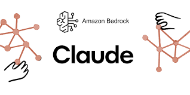

# Topics

          

Use Amazon Novo to generate answers          
Use Amazon Novo to generate answers with context         

   
               

Use Anthropic Claude to generate answers with context         
   

                

Use Anthropic Claude to generate answers using simple RAG with Qdrant as the Vector Store              

   

              

Use Agents using Crew AI and Anthropic Claude to generate answers with Tools             
   * Crew AI with Tool DuckDuckGo   
   * Crew AI with a Router choosing either  DuckDuckGo or CalculatorAdd or Both       
   * Crew AI with a Agentic RAG using Qdrant and DuckDuckGo

               

           

Discover Advanced RAG with Qdrant and Amazon Bedrock with Anthropic Claude                                        
     *  Dense Embeddings              
     *  Sparse Embeddings             
     *  Dense , Sparse  Embeddings and Fusion Techniques           
     *  Dense, Sparse and Late Interaction Techniques        

    
